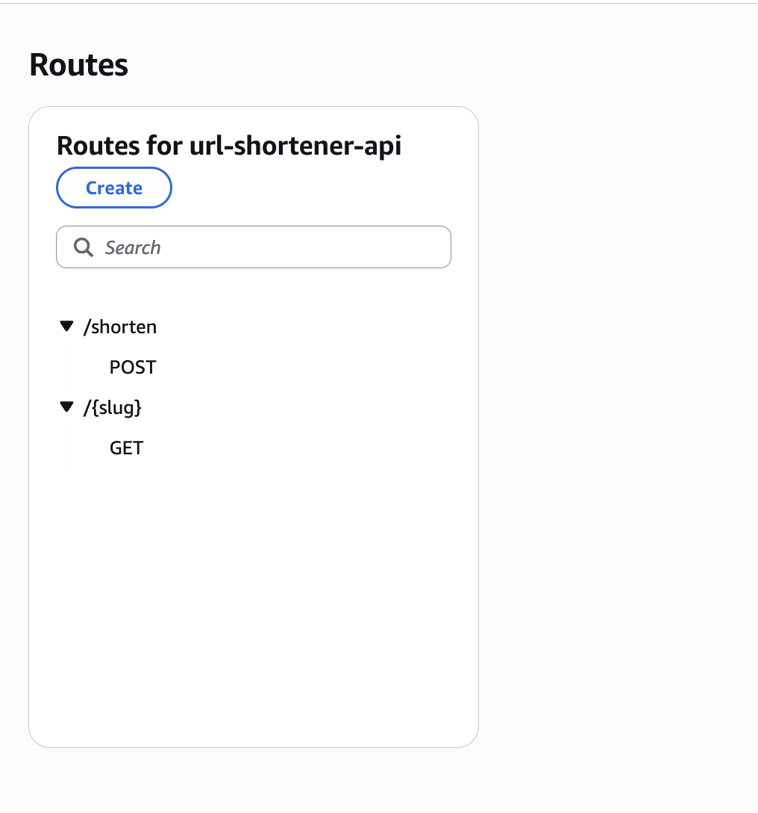

# Serverless URL Shortener

A fully serverless, scalable, and cost-efficient URL shortener built using AWS Lambda, API Gateway, and DynamoDB — deployed via Terraform. The system allows users to generate and access shortened URLs, leveraging the performance and affordability of AWS's serverless ecosystem.

---

## Features

- **Serverless Architecture**: Utilizes AWS Lambda and API Gateway for seamless scaling and zero server maintenance.
- **DynamoDB Storage**: Fast, reliable, and cost-effective NoSQL database for storing original URLs and their shortened slugs.
- **Two Lambda Endpoints**:
  - `POST /shorten`: Accepts a URL and returns a shortened slug.
  - `GET /{slug}`: Redirects the user to the original URL.
- **On-Demand Billing**: Uses pay-per-request DynamoDB and Lambda, minimizing costs and often staying within the AWS free tier.
- **IAM Least Privilege**: Uses Terraform-managed roles and policies to follow the principle of least privilege.
- **Infrastructure as Code**: Fully reproducible and version-controlled deployment using Terraform.
- **Clean Teardown**: All infrastructure can be destroyed using a single Terraform command.

---

## Tech Stack

| Category       | Tools Used                      |
|----------------|----------------------------------|
| Cloud Provider | AWS                              |
| Compute        | AWS Lambda                       |
| API Gateway    | Amazon API Gateway (HTTP API v2) |
| Database       | Amazon DynamoDB                  |
| Infrastructure | Terraform                        |
| Language       | Python (with Boto3)              |

---

## Setup and Deployment

### 1. Prerequisites

- AWS CLI installed and configured (`aws configure`)
- Terraform installed
- Python 3.x installed

### 2. Configure AWS Credentials

```bash
aws configure
# Provide AWS Access Key ID, Secret Access Key, Region
```

### 3. Package Lambda Functions

```bash
cd scripts
bash deploy.sh
```

### 4. Deploy the Infrastructure

```bash
cd terraform
terraform init
terraform apply
```

Type `yes` when prompted to confirm infrastructure provisioning.

#### Terraform Init Screenshot


#### Terraform Apply Screenshots

  
  
  
  
  
  


---

## API Endpoints

After deployment, Terraform will output an API Gateway endpoint:

```
api_endpoint = "https://<your-id>.execute-api.us-east-1.amazonaws.com"
```

### Shorten a URL

```bash
curl -X POST https://<api_id>.execute-api.<region>.amazonaws.com/shorten \
  -H "Content-Type: application/json" \
  -d '{"url": "https://example.com"}'
```

**Response:**
```json
{
  "short_url": "https://<api_id>.execute-api.<region>.amazonaws.com/a1b2c3"
}
```

### Redirect to Original URL

```bash
curl -v https://<api_id>.execute-api.<region>.amazonaws.com/a1b2c3
```

Or open the shortened URL in a web browser.

#### Browser Redirect Screenshot


---

## API Routes

The application exposes the following HTTP API routes via Amazon API Gateway:

| Method | Route        | Description                                      |
|--------|--------------|--------------------------------------------------|
| POST   | /shorten     | Accepts a long URL and returns a shortened slug. |
| GET    | /{slug}      | Redirects the user to the original long URL.     |

#### API Gateway Console Screenshot

Below is a screenshot of the deployed routes as seen in the AWS API Gateway console:



---

## AWS Resources

### Lambda Functions

- `shorten_url.py`: Generates short slugs and writes the mapping to DynamoDB.
- `redirect_url.py`: Retrieves the original URL from DynamoDB and returns a redirect response.

#### Lambda Console Screenshot


---

### DynamoDB Table

Stores mappings of slugs to original URLs. The table uses on-demand billing for cost efficiency.

#### DynamoDB Screenshot


---

## Teardown

To delete all infrastructure:

```bash
terraform destroy
```

Type `yes` when prompted to confirm.
