# Serverless URL Shortener

A fully serverless, scalable, and cost-efficient URL shortener built using AWS Lambda, API Gateway, and DynamoDB — all deployed via Terraform. It allows users to generate shortened URLs and redirect them, just like Bit.ly, while leveraging the performance and affordability of AWS's serverless ecosystem.

---

## Features

- **Serverless Architecture**: Built using AWS Lambda and API Gateway for automatic scaling and zero-server management.
- **DynamoDB Storage**: Fast, reliable, and cost-effective NoSQL storage to store original URLs and their shortened slugs.
- **Two Lambda Endpoints**:
  - `POST /shorten` – Accepts a URL and returns a shortened slug.
  - `GET /{slug}` – Redirects to the original URL.
- **On-Demand Billing**: Pay-per-request DynamoDB and Lambda ensure minimal operating costs (under AWS free tier for low traffic).
- **IAM Least Privilege**: Role-based access with Terraform-managed permissions.
- **Infrastructure as Code**: Entire deployment is reproducible using Terraform.
- **Clean Teardown**: All resources can be destroyed with a single command.

---

## Tech Stack

| Category       | Tools Used                      |
|----------------|----------------------------------|
| Cloud Provider | AWS                              |
| Compute        | AWS Lambda                       |
| API Management | Amazon API Gateway (HTTP API v2) |
| Database       | Amazon DynamoDB                  |
| IaC            | Terraform                        |
| Language       | Python (Boto3)                   |

---

## Setup & Deployment
---
### 1. Prerequisites

- AWS CLI configured (`aws configure`)
- Terraform installed
- Python 3.x installed

---

### 2. Configure AWS Credentials

- aws configure
# Enter your AWS Access Key ID, Secret, and Region

---

### 3. Package Lambda Functions
- cd scripts
- bash deploy.sh

---

### 4. Deploy the Infrastructure
- cd terraform
- terraform init
- terraform apply

When prompted, type yes to provision the infrastructure.

Terraform Init:
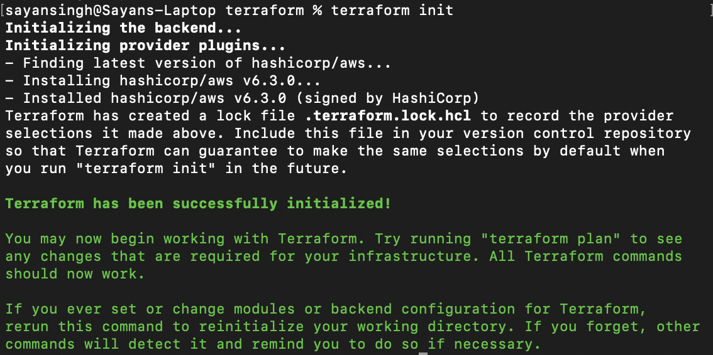

Terraform Apply Screenshots:

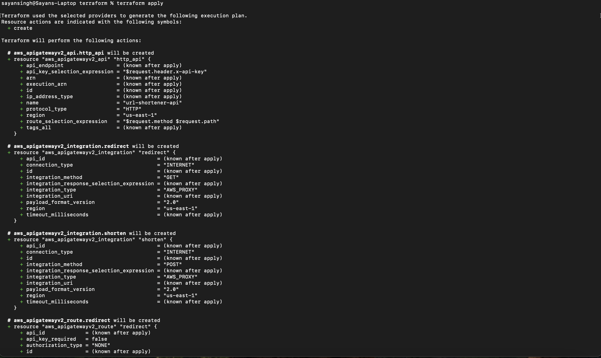
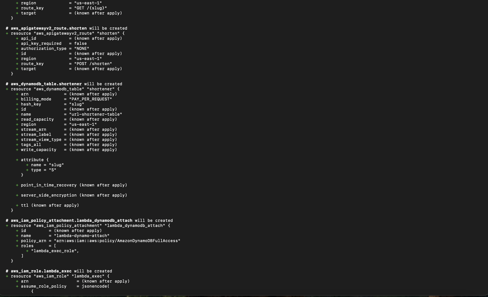
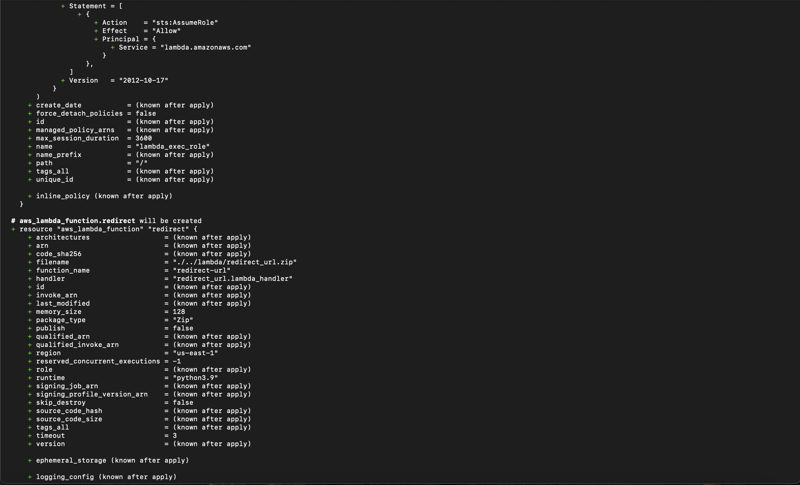
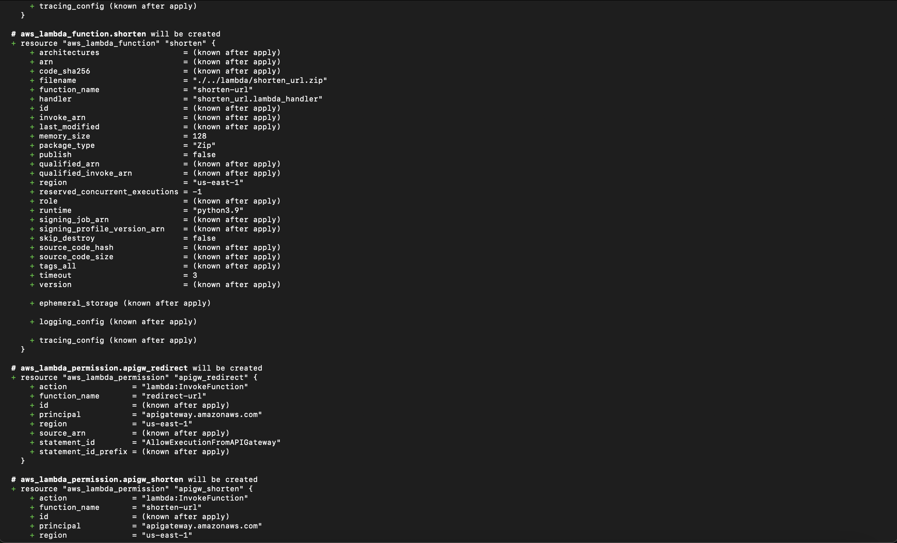
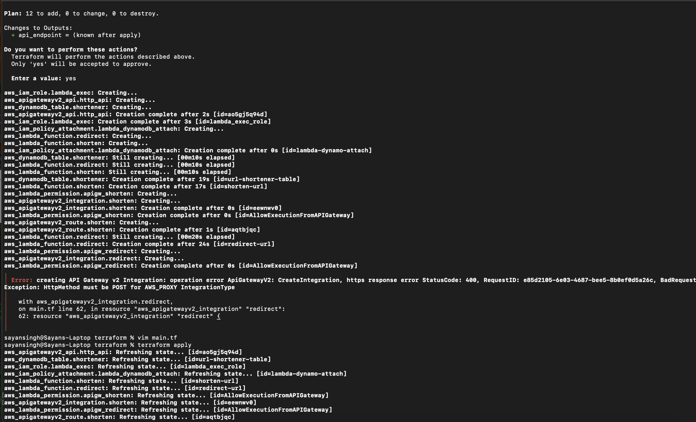
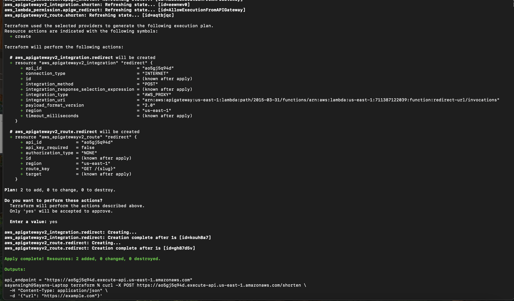
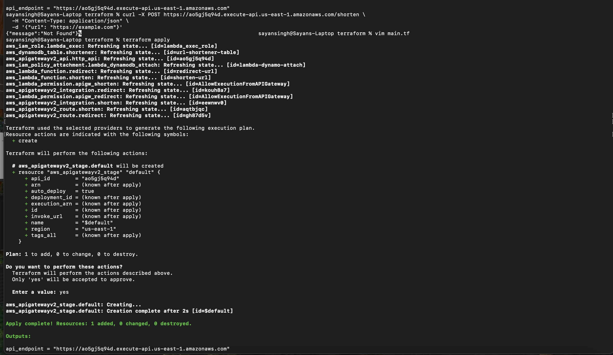

---

### API Endpoints
After deployment, Terraform will output your API Gateway endpoint like:

api_endpoint = "https://<your-id>.execute-api.us-east-1.amazonaws.com"

### How to Use

## 1. Shorten a URL
curl -X POST https://<api_id>.execute-api.<region>.amazonaws.com/shorten \
  -H "Content-Type: application/json" \
  -d '{"url": "https://example.com"}'

Response:
{
  "short_url": "https://<api_id>.execute-api.<region>.amazonaws.com/a1b2c3"
}

## 2. Redirect to Original URL
 curl -v https://<api_id>.execute-api.<region>.amazonaws.com/a1b2c3

Or open the link in your browser.

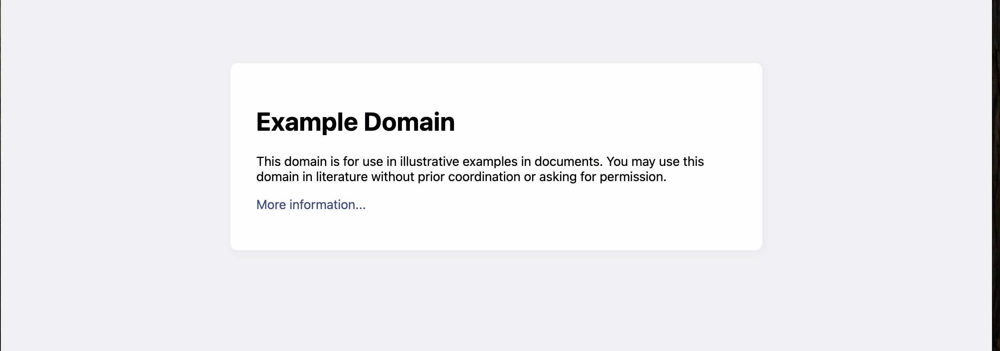

### AWS Resources

## Lambda Functions
shorten_url.py: Generates short slugs and writes to DynamoDB.

redirect_url.py: Looks up original URL by slug and redirects.

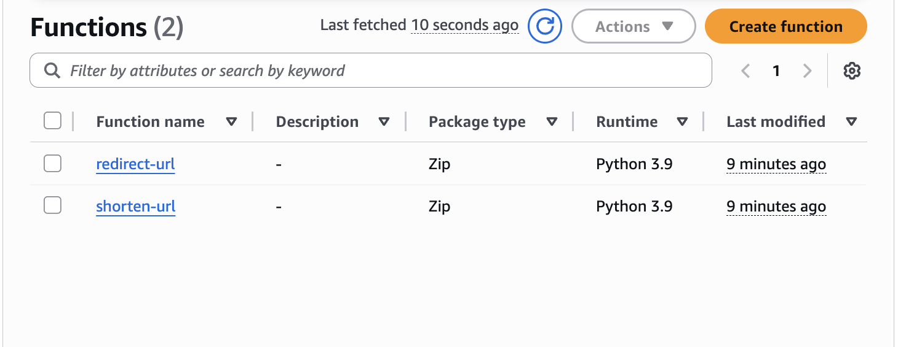

### DynamoDB Table
Stores mappings between slugs and original URLs.

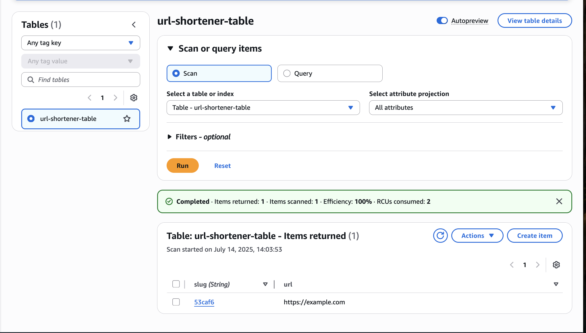

### Teardown
To destroy all resources:

terraform destroy

Type yes to confirm.

